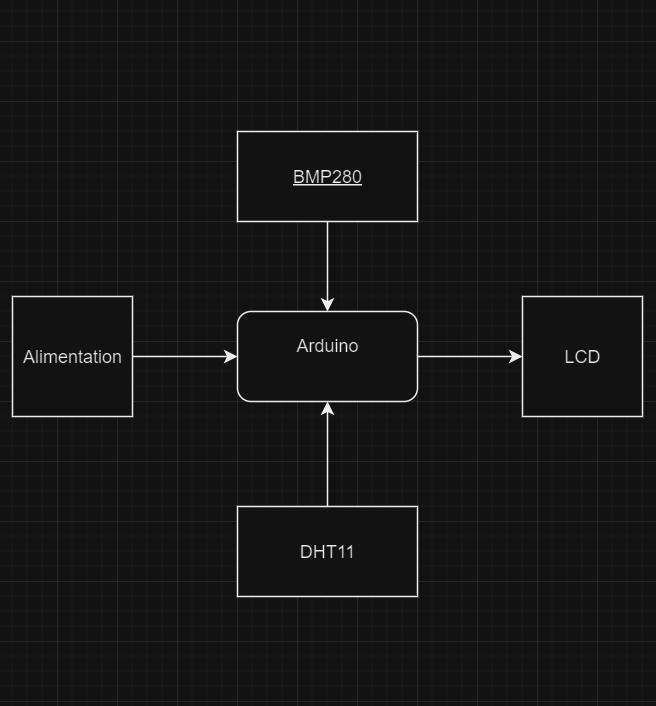
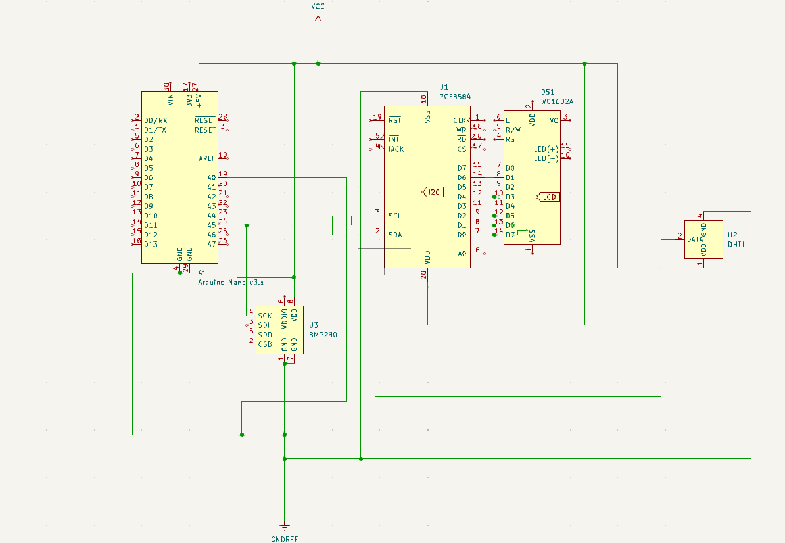

# Station meteo

### Block diagram

<!-- Make sure the path to the picture is correct -->

### Schematic

### Libraries

<!-- This is just an example, fill in the table with your actual components -->

| Library | Description | 
|---------|-------------|
| [screen](https://github.com/blackhack/LCD_I2C/blob/master/src/LCD_I2C.h) | Arduino library to control a 16x2 LCD via an I2C adapter based on PCF8574|
| [temp](https://github.com/adafruit/DHT-sensor-library) | An Arduino library for the DHT series of low-cost temperature/humidity sensors. |
| [pressure](https://github.com/adafruit/Adafruit_BMP280_Library) | This driver is for the Adafruit BMP280 Breakout | 

